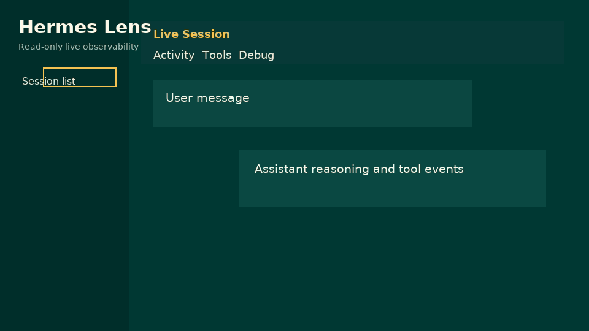

# Hermes Lens

Read-only live observability for Hermes sessions.

Hermes Lens is a standalone sidecar WebUI for observing Hermes-compatible JSONL
event streams. It does not submit prompts, invoke tools, control agents, or
participate in the response path.

[中文说明](README.zh-CN.md)



## Features

- Live session discovery from JSONL event streams.
- Chat-style Activity view with user, assistant, thinking, tool, error, and
  media blocks.
- Debug, Tools, and Errors views for deeper inspection.
- Folded-by-default reasoning, tool details, and raw event drawer.
- Media preview through an allowlisted `/api/media` endpoint.
- Four themes: Hermes Dark, Hermes Light, VS Code Dark, and VS Code Light.
- Read-only architecture: no prompt submission, no tool execution, no control
  path.

## Quick Start

Install dependencies manually:

```bash
git clone https://github.com/your-org/hermes-lens.git
cd hermes-lens

python3 -m venv .venv
. .venv/bin/activate
pip install -r backend/requirements.txt

cd frontend
npm install
npm run build
cd ..
```

Start the backend and frontend together:

```bash
./scripts/dev.sh
```

Default URLs:

- Frontend: `http://127.0.0.1:5173`
- Backend: `http://127.0.0.1:8000`
- Events: `~/.hermes/live-events`

`scripts/dev.sh` does not install dependencies or create runtime directories.
It checks the existing environment and fails with setup hints when `.venv`,
backend packages, `node_modules`, frontend build output, or the event directory
are missing.

For remote access, either use SSH port forwarding or bind to all interfaces:

```bash
HERMES_MONITOR_FRONTEND_HOST=0.0.0.0 \
HERMES_MONITOR_BACKEND_HOST=0.0.0.0 \
./scripts/dev.sh
```

By default the script serves the built frontend and does not start file
watchers. For hot-reload development:

```bash
HERMES_MONITOR_DEV_WATCH=1 ./scripts/dev.sh
```

## Hermes Exporter

The exporter source lives in `integrations/hermes_live_monitor`. Install and
enable it as a Hermes user plugin:

```bash
mkdir -p ~/.hermes/plugins/live-monitor-exporter
cp integrations/hermes_live_monitor/__init__.py \
  integrations/hermes_live_monitor/plugin.yaml \
  ~/.hermes/plugins/live-monitor-exporter/
hermes plugins enable live-monitor-exporter
```

Hermes profiles have separate homes. For a profile such as `planner`, install
and enable the plugin under that profile's `HERMES_HOME`:

```bash
export HERMES_HOME=~/.hermes/profiles/planner
mkdir -p "$HERMES_HOME/plugins/live-monitor-exporter"
cp integrations/hermes_live_monitor/__init__.py \
  integrations/hermes_live_monitor/plugin.yaml \
  "$HERMES_HOME/plugins/live-monitor-exporter/"
hermes plugins enable live-monitor-exporter
```

Restart Hermes after enabling or updating the plugin. New events are written to:

```text
~/.hermes/live-events/<session_id>.jsonl
```

Image inputs are materialized under `~/.hermes/live-media` and referenced from
events. Old JSONL entries that already contain truncated base64 image payloads
cannot be recovered.

On startup, the exporter also reads the current profile's `state.db` in
read-only mode to bootstrap recently active sessions. Disable that with
`HERMES_MONITOR_BOOTSTRAP_STATE_DB=0` if only future hook events should appear.

## Architecture

```text
Hermes / planner / tools
  -> non-blocking exporter
  -> JSONL event stream
  -> FastAPI backend
  -> SSE + REST API
  -> React WebUI
```

The event stream is the integration contract. Hermes Lens should remain a
viewer, not a gateway or controller.

## Non-Goals

- Not a Hermes replacement.
- Not a prompt gateway.
- Not a tool or robot controller.
- Not in the final response path.
- Not an arbitrary file browser.

## Security Model

- Event payloads are treated as untrusted input.
- The frontend renders text and JSON, not HTML from event payloads.
- `/api/media` only serves files under configured allowlisted roots.
- Media is stored as references, not inline base64 blobs.
- Exporter failures must not block Hermes or planner execution.

## Configuration

```bash
export HERMES_MONITOR_EVENTS_DIR=/path/to/live-events
export HERMES_MONITOR_MEDIA_ROOTS=/path/to/media:/another/allowed/path
export HERMES_MONITOR_HEARTBEAT_TTL=30
export HERMES_MONITOR_POLL_INTERVAL=0.5
```

When `HERMES_MONITOR_MEDIA_ROOTS` is unset, the backend only allows the
exporter's default `~/.hermes/live-media` directory.

## Development

Backend:

```bash
python3 -m venv .venv
. .venv/bin/activate
pip install -r backend/requirements.txt
uvicorn backend.main:app --reload
```

Frontend:

```bash
cd frontend
npm install
npm run dev
```

Checks:

```bash
PYTEST_DISABLE_PLUGIN_AUTOLOAD=1 .venv/bin/python -m pytest backend/tests

cd frontend
npm run typecheck
npm test
npm run build
npm run visual-check
```

`visual-check` expects both development servers to be running and uses the
system Chrome to validate 1366x768, 1440x900, and 390x844 viewports.

Run exporter tests:

```bash
python3 -m unittest discover \
  -s integrations/hermes_live_monitor/tests -v
```

## License

MIT. See [LICENSE](LICENSE).
